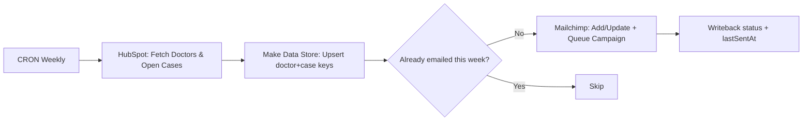

# Clinic Weekly Reminders (HubSpot → Make Data Store → Mailchimp)
Sends weekly reminder emails to clinic doctors about open cases. Uses Make Data Store for stateful tracking and idempotent sends.

## Flow (Mermaid)

## Why it’s interesting
- **Stateful logic**: Make Data Store for dedupe/idempotency (no double sends)
- **Batching**: chunk, throttle, and retry on API limits
- **Mapping**: HubSpot properties → Mailchimp merge fields
- **Observability**: per-doctor counters, lastSentAt, error notes

## Files
- `01_pull_cases_hubspot.json` – HS search + field normalization  
- `02_campaign_group_A.json` – Create/tag/schedule for Group A (brand-agnostic)  
- `03_campaign_group_B.json` – Create/tag/schedule for Group B (brand-agnostic)  
- `04_track_campaign_sent.json` – Webhook → mark sent + remove tag  
- `05_clear_datastore.json` – Maintenance: wipe Data Store before next run

## Placeholders
- `{{hubspotConnection}}`, `{{hubspotDealStageId}}`, `{{hubspotPipelineId}}`, `{{hubspotOwnerId}}`
- `{{mailchimpListId}}`, `{{mailchimpSegmentId}}`, `{{mailchimpTemplateId}}`, `{{mailchimpFolderId}}`
- `{{dataStoreId1}}`, `{{dataStoreId2}}`
- `{{redactedEmail}}`, `{{redactedPhone}}`, `{{externalUrl}}`
- Make webhook IDs masked: `https://hook.…make.com/xxxxxx`

## Notes
- Weekly CRON; safe to re-run (idempotent)
- All IDs/URLs redacted; map your own fields on import

📜 License: CC BY-NC 4.0
