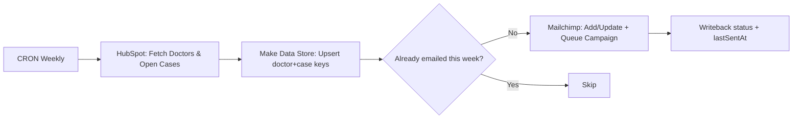

# Clinic Weekly Reminders (HubSpot → Make Data Store → Mailchimp)
This workflow runs a **stateful weekly reminder system** that connects **HubSpot → Make Data Store → Mailchimp** so each doctor gets one timely update about open cases — **no duplicates, no misses**. 
It remembers who you’ve already emailed, gracefully talks to HubSpot and Mailchimp, and politely avoids spamming anyone twice (because nobody likes that doctor who gets 3 reminders in one day). Designed like a **workflow architect**, maintained like a **lazy engineer** who never wants to fix duplicates again

## Flow (Mermaid)

**What it does**
- Pulls doctors + open cases from **HubSpot**
- Tracks sends in **Make Data Store** for weekly idempotency
- Syncs/updates audience in **Mailchimp**, triggers reminders
- Logs delivery metadata (`lastSentAt`, `caseCount`), resets state weekly

**Under the hood**
- **Stateful design** for dedupe/idempotency across runs  
- **Batching & throttling** with safe retries under API limits
- Workflow **architecture & orchestration** in Make.com  
- **Data Store** as a lightweight database  
- **API pagination, rate limiting, and retry** patterns  
- **CRM → Email** integration and data normalization  
- Production-grade **error handling & monitoring**

## Files
- `01_pull_cases_hubspot.json` – HS search + field normalization  
- `02_campaign_group_A.json` – Create/tag/schedule for Group A (brand-agnostic)  
- `03_campaign_group_B.json` – Create/tag/schedule for Group B (brand-agnostic)  
- `04_track_campaign_sent.json` – Webhook → mark sent + remove tag  
- `05_clear_datastore.json` – Maintenance: wipe Data Store before next run

## Placeholders
- `{{hubspotConnection}}`, `{{hubspotDealStageId}}`, `{{hubspotPipelineId}}`, `{{hubspotOwnerId}}`
- `{{mailchimpListId}}`, `{{mailchimpSegmentId}}`, `{{mailchimpTemplateId}}`, `{{mailchimpFolderId}}`
- `{{dataStoreId1}}`, `{{dataStoreId2}}`
- `{{redactedEmail}}`, `{{redactedPhone}}`, `{{externalUrl}}`
- Make webhook IDs masked: `https://hook.…make.com/xxxxxx`

## Notes
- Weekly CRON; safe to re-run (idempotent)
- All IDs/URLs redacted; map your own fields on import

📜 License: CC BY-NC 4.0
