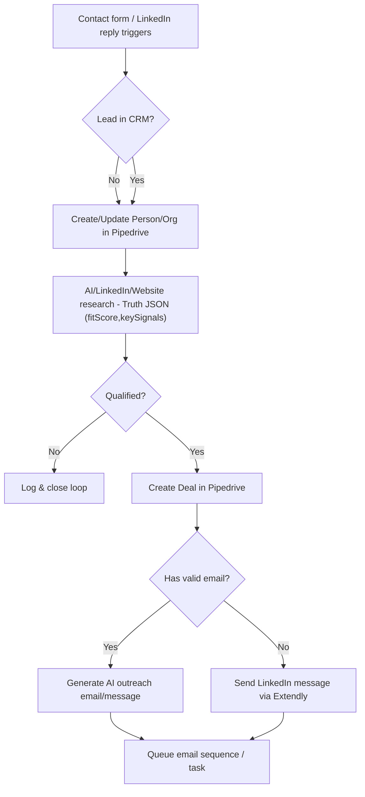

# Inbound Lead Engine (Agencies & Services)
Make.com + Pipedrive + AI Enrichment + LinkedIn/Email Outreach

A production-ready inbound system for agencies: capture leads → enrich & score → create/update in Pipedrive → open deals for qualified leads → generate AI outreach → fallback to LinkedIn if no email.

---

## Why it matters
- Faster first touch with **AI-personalized** context
- **Higher pipeline quality** via fit scoring & signal checks
- **Robust reliability**: retries, rate limits, and fallbacks

---

## Flow Diagram

---

## Key Capabilities
- **AI reliability:** JSON schema cleanup, default fallbacks, and routing if enrichment is partial.
- **Error handling:** retries with backoff, defensive checks, and safe breaks (prevents cascade failures).
- **Data hygiene:** dedupe, email deliverability gates, normalization before CRM write.
- **Outreach decisioning:** email path when available, **LinkedIn fallback** when not.

---

## Files
- `01_webform_capture.json` – Webhook intake & normalization.
- `02_linkedin_reply_capture.json` – Extendly reply hook → contact mapping.
- `03_enrich_and_score.json` – Research & **Truth JSON** with `fitScore` + `keySignals`.
- `04_create_deals.json` – Open deals for qualified leads with stage/owner mapping.
- `05_ai_outreach_message.json` – Generate first message with approved prompts.
- `06_linkedin_no_email_fallback.json` – If no email, send via Extendly LinkedIn.

---

## Placeholders (examples)
- `{{pipedriveApiToken}}`, `{{pipedrivePipelineId}}`, `{{pipedriveStageId}}`
- `{{airtableBaseId}}`, `{{airtableTableId1}}`, `{{fieldIdLeadStatus}}`
- `{{extendlyConnection}}`, `{{openaiConnection}}`, `{{perplexityConnection}}`

---

## Notes on Reliability
- **Retries & throttling:** backoff sleeps around API loops; guarded routers to skip nulls.
- **Fallbacks:** if Perplexity/LinkedIn About missing → use Claude recap or default message shell.
- **Approval gates:** only **approved** AI copy moves to outreach.
- **Observability:** lightweight logs/flags for qualification, enrichment source, and confidence.

---

## License
CC BY-NC 4.0 — Portfolio/demo only. Commercial use requires permission.
